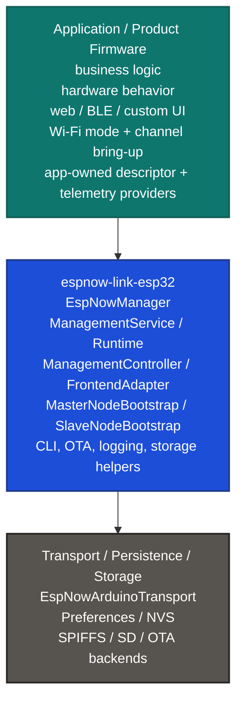
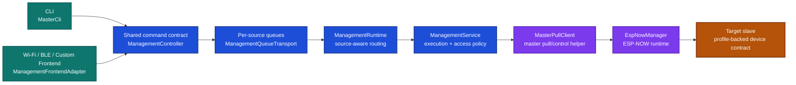
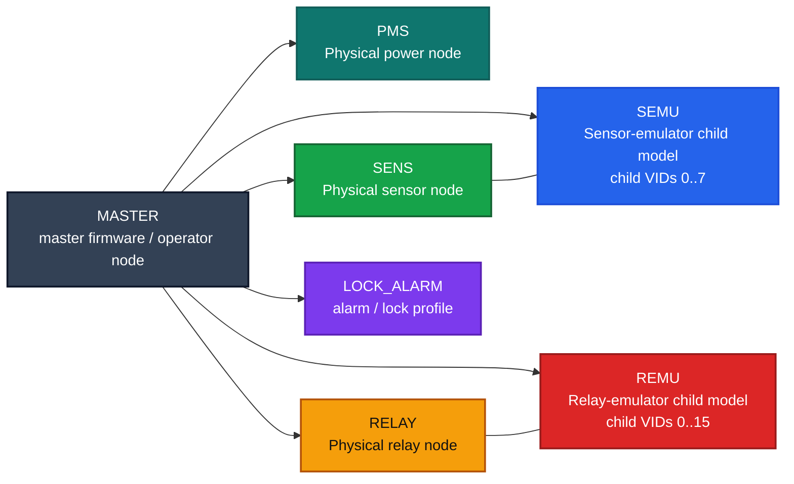

# espnow-link-esp32

`espnow-link-esp32` is an ESP32 firmware infrastructure library for building secure ESP-NOW systems with one master node and multiple slave nodes.

It is meant for projects where the master needs to discover, pair, manage, configure, monitor, and update remote devices over ESP-NOW without every firmware re-implementing pairing logic, command routing, schema handling, telemetry transport, and OTA plumbing from scratch.

This library is more than a packet wrapper. It gives you a reusable runtime and control model for ESP-NOW device fleets.

## What This Library Is For

Use this library when you want firmware that behaves like this:

- a master can discover and pair slaves, remember them, and target them explicitly
- slaves expose typed descriptors, settings, telemetry, and OTA capabilities
- CLI tools and app frontends use the same command contract
- device-specific settings and telemetry are defined by profiles instead of ad-hoc strings
- OTA, logging, storage, diagnostics, and topology control are part of the firmware stack

In this repository, that model is used for master and slave roles such as `PMS`, `RELAY`, `SENS`, `SEMU`, and `REMU`.

## Firmware Layer View

Think of `espnow-link-esp32` as the middle layer between your product firmware and the ESP-NOW radio/storage backends:

The important idea is that your application still owns the product behavior and board bring-up, while `espnow-link-esp32` owns the reusable communication and management machinery in the middle.

## How To Think About It

- A slave firmware uses this library to expose a typed remote device contract over ESP-NOW.
- A master firmware uses this library to operate that contract through a stable management plane.
- Profiles define what settings, telemetry metrics, and events a device role supports.
- The CLI and frontend APIs are two different surfaces over the same management command IDs.
- On the master side, peer-bound operations should be thought of as explicitly targeted operations against one persisted slave.
- Your application still owns the hardware-specific behavior, device UI, and Wi-Fi bring-up decisions.

If you want the shortest mental model: this library turns raw ESP-NOW links into manageable devices.

## Master Control Path

This is the path a typical master-side command takes when it comes from the CLI or from a frontend:

Why this matters:

- the CLI and frontend adapters do not define separate wire protocols
- source tags such as `Cli`, `Wifi`, `Ble`, and `Custom` are preserved through the runtime
- access level is enforced in the management layer, not trusted from presentation code
- `ManagementFrontendAdapter` adds cache, wait, and operation tracking, but it still ends up on the same command IDs

## Runtime Model

The runtime is easiest to understand as four cooperating layers:

- `EspNowManager`
  Owns pairing, restore, active-peer switching, pull/control traffic, telemetry push, and transport-facing runtime state.
- `ManagementService`
  Owns command execution, policy checks, access-level gating, and lifecycle event generation.
- `ManagementRuntime`
  Owns request intake from transports and source-aware response/event routing back out.
- `ManagementController` and `ManagementFrontendAdapter`
  Provide the typed API that CLI and product frontends use instead of hand-building packets.

On the slave side, the equivalent idea is: the slave exposes one typed device contract, and the library handles how that contract is transported, guarded, and answered over ESP-NOW.

## What The Library Does Today

### Core runtime

- master and slave runtime support
- secure pairing and persisted peer restore
- master-side multi-peer management with explicit target-peer semantics
- hard persisted master capacity of 14 paired peers
- descriptor/control payload transport over ESP-NOW
- time synchronization support

### Shared management plane

- one typed command contract used by CLI and API/frontends
- request, response, and event routing by source: `Cli`, `Wifi`, `Ble`, `Custom`
- access-level gating: `Observer`, `Operator`, `Maintainer`, `Owner`
- queue-based transport for concurrent frontends

### Device data model

- device descriptor, capabilities, settings, telemetry, liveness, and time reads
- setting get/set by key or by numeric id
- resolved setting helpers for UI flows
- profile-aware telemetry schema and current-value pulls
- telemetry push streams with runtime validation

### Frontend and operator support

- `MasterCli` reference console for the master role
- `ManagementController` for typed command submission
- `ManagementFrontendAdapter` for orchestration, cache handling, operation tracking, and frontend-safe helpers
- convenience frontend adapters for Wi-Fi, BLE, and custom sources

### Fleet control and maintenance

- discovery, pair, unpair, remove-peer lifecycle
- topology stage, commit, status, slot inspection, and trigger send
- channel sync and chain-loop controls
- local and remote logging controls
- storage info, list, stat, and format commands
- OTA status, manifest, transfer, push, update, apply, rollback, and archive flows
- diagnostics such as ping, queue stats, metrics, and communication tests
- radio-transition guards for apps that temporarily change Wi-Fi/radio state

## Profiles and Device Roles

Built-in profile registration is available through `registerBuiltInProfiles(...)`, and the repository also includes app-owned profile/schema packages under `profile_catalog`.

The current role landscape looks like this:

How to read that graph:

- `PMS`, `SENS`, and `RELAY` are physical device roles used directly by slave firmware
- `SEMU` and `REMU` are profile models with child namespaces, which is why their settings and telemetry include child-scoped keys
- the master is not just a packet forwarder; it is the management and orchestration side of the system
- the same management plane can operate across these different roles because the profile registry gives each role a stable schema and identity map

Current built-in profile IDs:

- `PMS`
- `RELAY`
- `SENS`
- `SEMU`
- `REMU`
- `LOCK_ALARM`

The examples in this repository focus on:

- `examples/master`
- `examples/slave_pms`
- `examples/slave_relay`
- `examples/slave_sens`
- `examples/slave_semu`
- `examples/slave_remu`

## Main Building Blocks

These are the classes most users should understand first:

- `EspNowManager`
  The core ESP-NOW runtime: pairing, restore, pull/control traffic, telemetry push, and active peer management.
- `MasterNodeBootstrap`
  Library-owned master wiring for `PairingStore -> EspNowManager -> MasterPullClient -> ManagementService -> ManagementRuntime -> MasterCli`.
- `SlaveNodeBootstrap`
  Library-owned slave wiring for `PairingStore -> EspNowManager -> SlaveControlPlane -> SlaveNodeRuntime`.
- `ManagementController`
  Typed command-submit API.
- `ManagementFrontendAdapter`
  Frontend-oriented layer for cache, wait helpers, operation tracking, and resolved read models.
- `MasterCli`
  The reference operator console for the master role.
- `ProfileRegistry`
  Registry for built-in and app-owned profiles.

## What Happens At Runtime

When this library is integrated correctly, the system behaves roughly like this:

1. the application brings up Wi-Fi in a mode that supports the product's ESP-NOW strategy
2. the firmware bootstraps transport, persistence, and optional storage or OTA backends
3. the local profile is registered so settings, telemetry, and events have a stable schema
4. the runtime comes up through `MasterNodeBootstrap` or `SlaveNodeBootstrap`
5. the master discovers and pairs slaves, persists them, and later restores them on reboot
6. CLI or frontend requests enter the shared management plane
7. the target slave responds with typed descriptors, settings, telemetry, logger data, storage data, or OTA state

That is why the repository contains both generic management code and role-specific profile packages. The management layer stays reusable, while the profile/provider layer carries device meaning.

## What Your Application Still Owns

This library removes a lot of firmware boilerplate, but it does not replace the application.

Your app is still responsible for:

- selecting and initializing the Wi-Fi mode before manager startup
- ensuring the ESP-NOW channel strategy matches your product design
- providing transport, persistence, and optional storage/OTA backends
- registering the local profile and codec used by the device
- implementing device-specific descriptor, settings, telemetry, and hardware behavior
- providing any web server, BLE UX, display UI, buzzer/LED feedback, or other product-facing surfaces

That split is visible in the examples:

- the app sets up Wi-Fi, SPIFFS, SD, NVS, and any web server/UI
- the library handles the reusable ESP-NOW runtime and management infrastructure

## Integration Shape

At a high level, master and slave integration look like this:

### Master firmware

1. bring up Wi-Fi in the mode your product needs
2. initialize persistence, logging, storage, and transport
3. register the local master profile/schema if your app owns one
4. configure `MasterNodeBootstrap`
5. call `begin(...)`
6. call `bringUp(...)`
7. drive the runtime with `loop()` or `tick(...)`
8. optionally create Wi-Fi, BLE, or custom frontend adapters

### Slave firmware

1. bring up Wi-Fi for ESP-NOW operation
2. initialize persistence, storage, and OTA backends as needed
3. construct the device-specific descriptor/telemetry provider for the role
4. configure `SlaveNodeBootstrap`
5. call `begin(...)`
6. call `bringUp(...)`
7. drive the runtime with `loop()` or `tick(...)`

If you want working references instead of theory, read `examples/master/src/main.cpp` and one of the slave examples side by side.

## Repository Layout

- `include/espnow_link/`
  Public library headers.
- `src/`
  Runtime, management, OTA, CLI, descriptor, platform, and transport implementation.
- `profile_catalog/`
  Built-in and app-owned profile/schema packages used by the examples.
- `examples/`
  Reference master and slave firmware projects.
- `docs/current/`
  The canonical implementation-focused documentation set for the current library behavior.

## Build Notes

- `library.json` packages the library for PlatformIO and the `espressif32` platform.
- The metadata declares `arduino` and `espidf` frameworks.
- The repository examples are Arduino/PlatformIO-oriented.
- `CMakeLists.txt` is present so the library can also be consumed as an ESP-IDF component.

## Documentation Map

If you are exploring the library itself, start here:

- `docs/current/architecture.md`
- `docs/current/control-plane.md`
- `docs/current/cli.md`
- `docs/current/frontend-api.md`
- `docs/current/profiles-registry.md`
- `docs/current/descriptors-settings.md`
- `docs/current/telemetry.md`
- `docs/current/ota.md`
- `docs/current/examples-integration.md`

## In One Sentence

`espnow-link-esp32` is the reusable firmware layer that lets an ESP32 master and multiple ESP32 slaves behave like a managed ESP-NOW device system instead of a collection of custom packet handlers.
