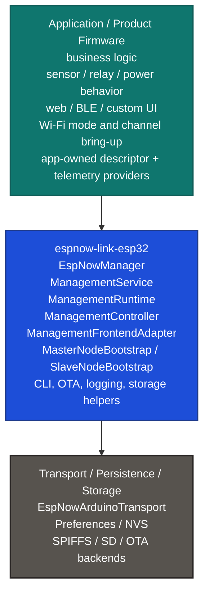
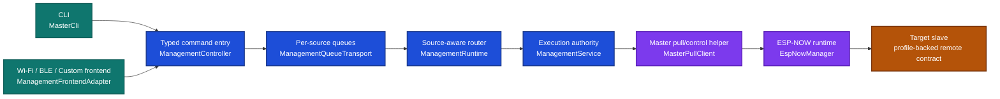
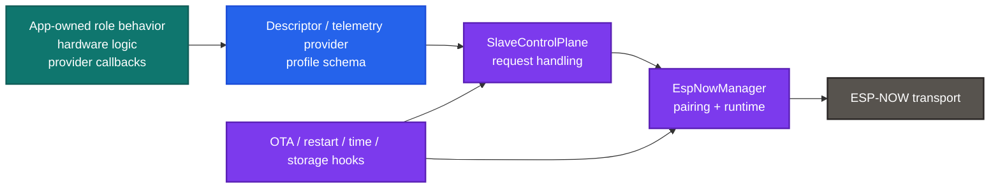
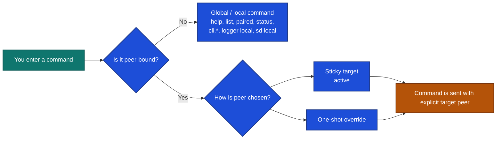
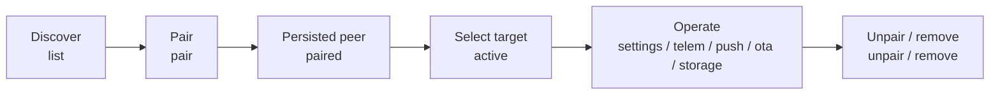
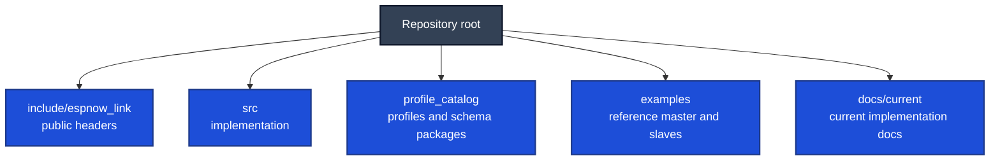
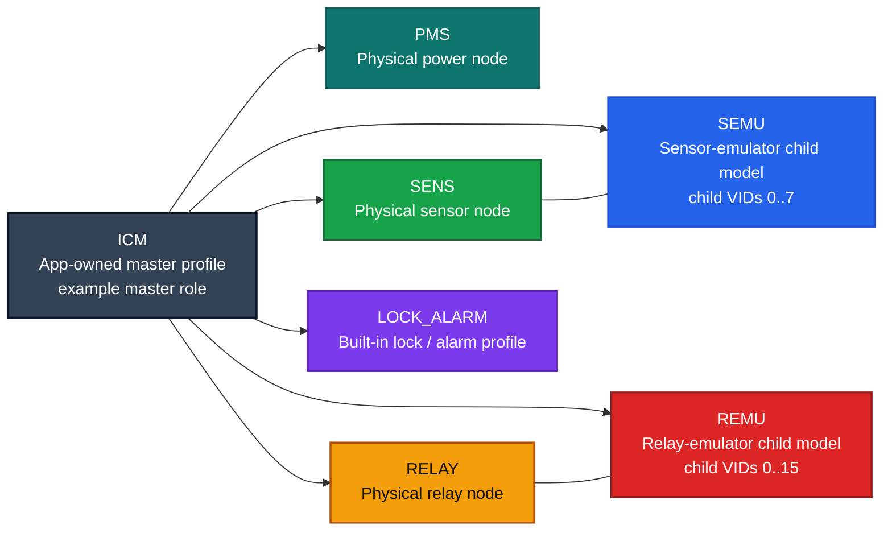
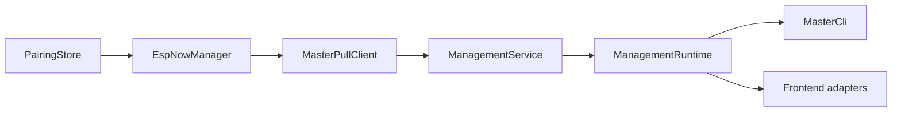
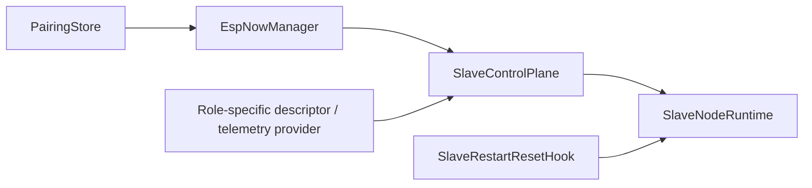

# espnow-link-esp32

`espnow-link-esp32` is a reusable ESP32 firmware stack for building secure ESP-NOW systems with one master node and multiple slave nodes.

It gives you a real runtime model, not just a packet helper:

- secure pairing and persisted peer restore
- a shared management plane used by CLI and frontend APIs
- typed descriptors, settings, telemetry, liveness, time, storage, and OTA operations
- profile-driven device roles such as `PMS`, `RELAY`, `SENS`, `SEMU`, and `REMU`
- master and slave bootstrap helpers that remove a large amount of firmware boilerplate

This README is the user-facing entry document for the repository. It is meant to help you:

- understand what the library does
- set up the environment to build and run it
- understand how the master and slave sides are structured
- operate the master CLI
- understand the device profiles and how they shape settings and telemetry
- know where to go next in `docs/current` for deeper implementation detail

## Quick Navigation

- [Project Author](#project-author)
- [What This Library Is](#what-this-library-is)
- [Environment Setup](#environment-setup)
- [Quick Start](#quick-start)
- [Mental Models](#mental-models)
- [Library Structure](#library-structure)
- [Feature Guide](#feature-guide)
- [Profiles and Roles](#profiles-and-roles)
- [CLI Guide](#cli-guide)
- [Master Integration](#master-integration)
- [Slave Integration](#slave-integration)
- [Application Responsibilities](#application-responsibilities)
- [Documentation Map](#documentation-map)

Fast links into deeper repo docs:

- [Architecture](docs/current/architecture.md)
- [Control Plane](docs/current/control-plane.md)
- [CLI Surface](docs/current/cli.md)
- [Frontend API](docs/current/frontend-api.md)
- [API Reference](docs/current/api-reference.md)
- [Profiles Registry](docs/current/profiles-registry.md)
- [Descriptors and Settings](docs/current/descriptors-settings.md)
- [Telemetry](docs/current/telemetry.md)
- [Pairing Lifecycle](docs/current/pairing-lifecycle.md)
- [Topology and Multi-Slave](docs/current/topology-multislave.md)
- [Topology CLI Authoring](docs/current/topology-cli-tpjson-authoring.md)
- [Logging and Storage](docs/current/logging-storage.md)
- [OTA](docs/current/ota.md)
- [Examples and Integration](docs/current/examples-integration.md)

## Project Author

This library project was developed by:

- Author: `Tshibangu Samuel`
- Role: `Freelance Embedded Systems Engineer`
- Expertise: `Secure IoT Systems, Embedded C++, RTOS, Control Logic`
- Contact: `tshibsamuel47@gmail.com`
- Portfolio: `https://www.freelancer.com/u/tshibsamuel477`
- Phone: `+216 54 429 793`

## What This Library Is

Use this library when you want firmware that behaves like a managed ESP-NOW device system instead of a collection of ad-hoc packet handlers.

In practical terms, this means:

- a master can discover slaves, pair them, remember them, and target them explicitly later
- slaves expose a typed remote contract for settings, telemetry, and maintenance operations
- the same command model can be used by a serial CLI, a Wi-Fi frontend, a BLE frontend, or a custom app surface
- profiles define the meaning of settings, telemetry metrics, and events
- OTA, logging, storage, diagnostics, and topology are part of the system design rather than separate one-off features

This repository includes:

- the core library implementation in `include/espnow_link` and `src`
- profile packages in `profile_catalog`
- a reference master example
- multiple reference slave examples
- current implementation docs in `docs/current`

## Environment Setup

This section is about getting the repository into a usable state so you can build, flash, monitor, and operate the examples.

### Host Tools You Need

You should have:

- Git
- either VS Code with the PlatformIO extension, or PlatformIO Core (`pio`) on the command line
- USB drivers for your ESP32 board
- a serial terminal path available through PlatformIO monitor or your own serial tool

The example projects in this repo are written around PlatformIO and Arduino on `espressif32`.

### Example Board Baseline

All example `platformio.ini` files currently target:

- platform: `espressif32`
- framework: `arduino`
- board: `esp32-s3-devkitc1-n8r8`
- partition table: `partitions_8M.csv`

That means the quickest path is to use an ESP32-S3 DevKitC-1 N8R8 or a compatible board definition.

If you change the board, you should re-check:

- flash and PSRAM compatibility
- partition layout
- storage expectations
- upload and monitor ports
- any board-specific Wi-Fi or peripheral assumptions in your app code

### Repository Layout Requirement For The Examples

The example `platformio.ini` files use symlink dependencies:

- `symlink://../..`
- `symlink://../../profile_catalog`

That means the examples expect to be built inside this repository layout. If you move only one example out of the repo, you will need to adjust `lib_deps`.

### Security And Radio Expectations

All nodes that should talk to each other must agree on the ESP-NOW security and radio assumptions.

The examples currently compile with the same PMK define:

```ini
-DESPNOW_LINK_PMK='"A7F3C91D4E2B86A0"'
```

Important rules:

- use the same PMK on the master and all slaves that should pair
- make sure the intended ESP-NOW channel strategy is consistent across devices
- remember that Wi-Fi mode and channel bring-up are application-owned responsibilities before manager startup

The current examples follow this general pattern:

- master example: `WIFI_AP_STA`
- slave examples: `WIFI_STA`

### Storage And Partition Expectations

The library itself is modular, but the reference examples make use of storage, logging, and OTA helpers.

In the examples, you will see:

- SPIFFS mounting
- SD card mounting
- OTA storage bootstrap helpers
- log storage bootstrap helpers

This matters because:

- the library can be used without every helper
- the examples are more demanding because they exercise more of the library surface
- some slave examples stop startup when the OTA/storage path is not ready

So if you are trying to run the example firmware exactly as provided, treat storage as part of the example environment, not as an optional extra.

### Ports And Monitor Speeds

The `upload_port` and `monitor_port` values in the example `platformio.ini` files are placeholders from the development machine that last used them.

You should update them to match your machine before flashing.

The example monitor speeds are not all identical:

- `examples/master`: `250000`
- `examples/slave_pms`: `250000`
- `examples/slave_relay`: `115200`
- `examples/slave_sens`: `115200`
- `examples/slave_semu`: `115200`
- `examples/slave_remu`: `115200`

The safest rule is simple:

- treat each example's own `platformio.ini` as the source of truth

### Recommended Setup Checklist

Before you build:

1. open the example project you want to run
2. check `board`, `upload_port`, `monitor_port`, and `monitor_speed`
3. make sure the PMK is identical across all nodes that should pair
4. make sure your board and partition assumptions match the example
5. make sure the serial port is not already busy

### Build, Flash, And Monitor

Typical PlatformIO CLI flow:

```bash
pio run -d examples/slave_pms
pio run -d examples/slave_pms -t upload
pio run -d examples/slave_pms -t monitor
```

And for the master:

```bash
pio run -d examples/master
pio run -d examples/master -t upload
pio run -d examples/master -t monitor
```

If you use VS Code + PlatformIO:

- open the repo
- choose the example folder you want to work with
- use the PlatformIO build, upload, and monitor actions for that example

## Quick Start

If you want the fastest path to seeing the library work:

1. choose one slave example such as `examples/slave_pms`
2. update its port and verify its monitor speed
3. build and flash that slave
4. build and flash `examples/master`
5. open the master serial monitor
6. use the CLI to discover, pair, target, inspect, and monitor the slave

A simple first-session workflow on the master looks like this:

```text
help
list
pair <index-or-mac>
paired
active <paired-index-or-mac>
desc
caps
settings
telem.now
ping
```

What those do:

- `help` shows the CLI reference and help topics
- `list` shows discovered peers
- `pair` creates a persisted paired relationship
- `paired` shows the deterministic paired list
- `active` sets the sticky peer target for later peer-bound commands
- `desc`, `caps`, `settings`, and `telem.now` let you inspect the selected slave

The current master example also includes a Wi-Fi frontend UI path. In the checked-in example code, the AP defaults are:

- SSID: `ENL-MASTER-UI`
- password: `12345678`

Those values are example defaults, not production recommendations.

## Mental Models

This section uses block-style diagrams to make the structure easier to remember.

### Firmware Layer View

Think of `espnow-link-esp32` as the middle layer between your product firmware and the ESP-NOW transport/storage infrastructure:



The main boundary to remember is:

- your application owns product behavior and bring-up
- the library owns reusable ESP-NOW runtime and management behavior

### Master Command Path

This is the mental model for how a typical master-side command flows:



Why this matters:

- CLI and frontend adapters are different surfaces over the same command model
- source identity such as `Cli`, `Wifi`, `Ble`, or `Custom` is preserved through the runtime
- access level is enforced in the management layer
- frontend adapters add cache, wait, and tracking helpers without inventing a separate protocol

### Slave Runtime View

The slave side is simpler to think about if you imagine one device contract being exposed through one runtime:



The slave does not need to know about CLI or web UI. It only needs to expose a consistent typed contract through its descriptor/provider layer.

### CLI Targeting Model

The CLI is easiest to use when you understand how target selection works:



If you remember only one CLI rule, remember this:

- peer-bound operations on the master should always be thought of as explicit target operations

### Pairing And Operation Lifecycle

This is the simple lifecycle most users will follow:



## Library Structure

This section explains how the repository is organized and how the library itself is broken down.

### Repository Structure Graph



### What Each Top-Level Area Is For

- `include/espnow_link`
  Public headers for the core runtime, management plane, CLI, OTA, transport, and bootstrap helpers.
- `src/core`
  Lower-level runtime behavior such as manager logic, protocol handling, receive dispatch, peer tracking, and lifecycle.
- `src/descriptor`
  Descriptor transport, profile codecs, profile handling, telemetry push, and master pull helpers.
- `src/management`
  The management command plane: controller, runtime, service, diagnostics, and queue transport behavior.
- `src/runtime`
  High-level master and slave bootstrap wiring, runtime loop wrappers, and runtime defaults.
- `src/cli`
  The master CLI implementation, dispatch layer, helpers, and rendering.
- `src/ota`
  OTA manager, firmware sink, and descriptor adapter behavior.
- `src/platform`
  Storage, OTA apply/storage, persistence, logging, and debug-related platform helpers.
- `src/transport`
  ESP-NOW transport implementation for Arduino.
- `profile_catalog`
  Built-in and app-owned role schemas, including the example master profile and supported slave profiles.
- `examples`
  Reference projects showing how to wire master and slave firmware around the library.
- `docs/current`
  Current implementation-focused documentation split by topic.

### Main Runtime Building Blocks

These are the core types most users should understand:

- `EspNowManager`
  Core ESP-NOW runtime: pairing, restore, active-peer switching, pull/control transport, telemetry push, and transport-facing state.
- `MasterPullClient`
  Master helper for typed pull/control requests over the manager.
- `ManagementService`
  Command execution authority with access checks and lifecycle handling.
- `ManagementRuntime`
  Request intake and source-aware routing back to transports.
- `ManagementController`
  Typed command-submit API.
- `ManagementFrontendAdapter`
  Frontend-oriented layer for cache, wait helpers, operation tracking, and explicit-target helpers.
- `MasterNodeBootstrap`
  Library-owned master-side object graph builder.
- `SlaveNodeBootstrap`
  Library-owned slave-side object graph builder.
- `MasterCli`
  Reference operator console for the master role.
- `ProfileRegistry`
  Registry that maps profile IDs and names to settings, telemetry, and event identity definitions.

## Feature Guide

This section breaks down the major feature families in the library and explains how they are meant to be used.

### Discovery, Pairing, And Peer Management

What it does:

- discovers peers
- pairs with them securely
- persists paired state
- restores paired state on reboot
- allows explicit peer removal

How to think about it:

- discovery shows what is visible now
- pairing creates a persisted trusted relationship
- the persisted paired list is what the master uses for stable targeting later

Current behavior highlights:

- master persisted pairing limit is `14`
- there is no automatic eviction at capacity
- once capacity is full, pair and discovery-start operations can be rejected with `CapacityLimitReached`

Useful CLI commands:

- `list`
- `pair <index|mac>`
- `paired`
- `unpair`
- `remove [index|mac|slave]`

### Management Plane

What it does:

- defines shared request, response, and event envelopes
- lets CLI and frontend APIs use the same command IDs
- stamps source and access identity into requests
- routes responses and events back to the correct surface

Core shared envelopes:

- `ManagementRequest`
- `ManagementResponse`
- `ManagementEvent`

Source identities:

- `Cli`
- `Wifi`
- `Ble`
- `Custom`
- `Unknown`

Access levels:

- `Observer`
- `Operator`
- `Maintainer`
- `Owner`

Important status ideas:

- `Ok`
- `OkDeferred`
- `Timeout`
- `DeniedByPolicy`
- `DeniedByRole`
- `QueueFull`
- `CapacityLimitReached`
- `BusyRadioTransition`

The key mental model is:

- CLI output is presentation
- management envelopes are the actual control contract

### Descriptors And Settings

What it does:

- exposes device identity and capabilities
- exposes telemetry schema and current telemetry
- exposes settings schema and current/default values
- supports get/set by key or by numeric id
- supports paged retrieval for larger descriptor surfaces

Descriptor domains handled by the library:

- device descriptor
- capabilities
- telemetry schema
- telemetry snapshot
- settings schema and values
- liveness
- time
- storage info
- OTA status and manifest data

Useful CLI commands:

- `desc`
- `caps`
- `settings`
- `settings.full`
- `settings.raw`
- `get <key>`
- `get.id <id>`
- `set <key>=<value>`
- `set.id <id>=<value>`

Important settings mental model:

- resolved value is `current_value` when present, otherwise `default_value`
- profile definitions are what give setting keys and IDs their meaning
- child-oriented roles use namespaced keys like `v<vid>.<field>`

### Telemetry Pull And Push

What it does:

- lets the master pull current telemetry snapshots
- lets the slave stream telemetry back through push configurations
- supports profile-aware and child-aware metric resolution

Pull-side CLI commands:

- `telem`
- `telem.now`
- `telem.now.child <vid>`

Push-side CLI commands:

- `push.start`
- `push.update`
- `push.pause`
- `push.resume`
- `push.stop`
- `push.get`
- `push.one <metric_key> <mode> <interval_ms> <delta_abs> <gap_ms>`
- `push.id <metric_id> <mode> <interval_ms> <delta_abs> <gap_ms>`
- `push.child.start <vid> [mode] [interval_ms] [delta_abs] [gap_ms]`
- `push.child.stop <vid>`
- `autopull on [ms]`
- `autopull off`

Push behavior highlights:

- modes include `Periodic`, `OnChange`, and `Hybrid`
- manager enforces stream interval and min-gap limits
- max metrics per stream is `16`
- duplicate and unknown metrics are rejected

### Topology, Channel, And Chain Control

What it does:

- stages and commits topology payloads
- lets the system inspect topology slot state
- sends topology triggers
- supports aggregate channel sync
- supports chain-loop control

Current topology limits:

- max topology slots: `13`
- max group seeds: `12`

Useful CLI commands:

- `topology.status`
- `topology.slots [committed|staged]`
- `topology.trigger <idx> <forward|reverse|1|2> [delay_ms] [hold_ms] [src_vid]`
- `topology.stage.hex <hex>`
- `topology.stage.file <path>`
- `topology.commit`
- `topology.apply.hex <hex>`
- `topology.apply.file <path>`
- `topology.plan.file <path>`
- `topology.deploy.file <path>`
- `topology.edit.*`
- `topology.chain.*`
- `channel.runtime.status`
- `channel.sync <1..14>`
- `chain.loop.status`
- `chain.loop.on`
- `chain.loop.off`

Important mental model:

- topology stage and commit are managed operations, not ad-hoc peer mutations
- explicit peer targeting remains important when topology commands are peer-bound

### Logging And Storage

What it does:

- provides local binary logger control on the master
- provides remote logger control on the slave
- provides local and remote storage browsing and formatting
- makes storage and OTA surfaces available through the same management plane

Useful CLI commands for local logger:

- `logger.status`
- `logger.enable`
- `logger.disable`
- `logger.clear`
- `logger.read <offset> [max_bytes]`

Useful CLI commands for remote logger:

- `logger.remote.status`
- `logger.remote.enable`
- `logger.remote.disable`
- `logger.remote.clear`
- `logger.remote.read <offset> [max_bytes]`
- `logger.remote.pull [max_bytes]`
- `logger.remote.stop`

Useful CLI commands for storage:

- `sd.info`
- `sd.pwd`
- `sd.ls [path]`
- `sd.cd <path>`
- `sd.up`
- `sd.stat <path>`
- `sd.format`
- `sd.remote.info`
- `sd.remote.pwd`
- `sd.remote.ls [path]`
- `sd.remote.cd <path>`
- `sd.remote.up`
- `sd.remote.stat <path>`
- `sd.remote.format`

Important mental model:

- local storage commands operate on the master-side bound storage backend
- remote storage commands operate on the selected slave through the management path

### OTA

What it does:

- reports OTA status and capacity
- exposes manifests and cleanup operations
- streams firmware to slaves
- applies or rolls back images
- supports local master update from staged image
- supports archive save, list, restore, verify, delete, and clear flows

Useful CLI commands:

- `ota.info`
- `ota.manifest`
- `ota.manifest.rebuild`
- `ota.capacity`
- `ota.gate`
- `ota.clear <in|img|man|all>`
- `ota.clear.images`
- `ota.local.clear.images`
- `ota.prepare`
- `ota.push <local_path> [chunk_bytes<=220]`
- `ota.push.abort`
- `ota.apply <image_id|name>`
- `ota.update <path> [chunk_bytes<=220]`
- `ota.update.master [path]`
- `ota.update.from.arc <id> [chunk_bytes<=220] [master|slave]`
- `ota.rollback <master|slave>`
- `ota.arc.save [master|slave]`
- `ota.arc.save.staged [master|slave]`
- `ota.arc.list [master|slave]`
- `ota.arc.verify <id> [role]`
- `ota.arc.restore <id> [role]`
- `ota.arc.delete <id> [role]`
- `ota.arc.clear [master|slave]`

Important OTA mental model:

- many OTA flows are deferred operations
- `OkDeferred` is not the same as final success
- terminal outcome comes from lifecycle completion
- push/update flows depend on storage and manifest conventions being correct

### Diagnostics And Radio Transitions

What it does:

- communication tests
- runtime metrics
- queue inspection
- radio transition guarding when the app temporarily changes Wi-Fi state

Useful CLI commands:

- `comm.test`
- `comm.test.status`
- `comm.test.report`
- `metrics`
- `metrics.reset`
- `queue`
- `radio.drytest`

Important radio-transition mental model:

- the app may need to change Wi-Fi mode or channel
- the management layer protects the system during that transition
- mutating commands can be rejected with `BusyRadioTransition` while the transition is active

### Frontend APIs

The library is not CLI-only.

There are two main frontend-facing layers:

- `ManagementController`
  Typed command submission.
- `ManagementFrontendAdapter`
  Orchestration, cache, operation tracking, explicit-target helpers, and frontend-friendly read models.

Use cases for `ManagementFrontendAdapter`:

- Wi-Fi frontend UI
- BLE frontend
- custom application control surfaces
- cache-backed settings UIs
- request tracking for asynchronous operations

The current master bootstrap can create frontend adapters for:

- Wi-Fi
- BLE
- custom sources

## Profiles and Roles

Profiles are what turn generic transport and management machinery into concrete device behavior.

### Role Landscape



How to read this:

- `ICM` is the app-owned master profile used by the reference master example
- built-in library profiles primarily describe remote device roles
- `PMS`, `SENS`, and `RELAY` are physical single-role devices
- `SEMU` and `REMU` are child-oriented role models with VID namespaces
- the management plane stays the same while the profile changes the meaning of keys, metrics, and events

### Built-In Profile IDs

The built-in registry includes:

- `PMS`
- `RELAY`
- `SENS`
- `SEMU`
- `REMU`
- `LOCK_ALARM`

The reference master example also registers an app-owned `ICM` profile from `profile_catalog/masters/icm`.

### Profile Mental Model

Profiles answer questions like:

- what settings exist for this device
- what telemetry metrics exist for this device
- what events exist for this device
- what keys and numeric IDs identify those fields
- which codec is the default for this device role

Without profiles, the library would only know how to move data. With profiles, it can operate meaningful remote devices.

### Profile Summary Table

| Profile | Kind | Mental model | Key telemetry examples | Key setting examples |
|---|---|---|---|---|
| `ICM` | app-owned master profile | master controller / UI node | paired count, online count, queue depth, local temp | AP/STA config, web config, orchestration defaults, liveness and queue policy |
| `PMS` | built-in physical slave | power management / battery / wall power | `wallv`, `battv`, `walli`, `batti`, `psrc`, `trip`, `rcut` | `chain_48v_enable`, `charger_enable`, `tripi`, voltage/current calibration and thresholds |
| `RELAY` | built-in physical slave | single physical relay device | `relay_bitmap`, `uptime_ms`, `env_temp_c` | `persist_output_state` and relay behavior settings |
| `SENS` | built-in physical slave | single physical sensor device | TF-Luna distance, flux, temperature, environment metrics | detection thresholds, calibration values, sample-loop settings |
| `SEMU` | built-in child model | multi-child sensor-emulator role | child metrics like `v<vid>.tfl_a_mm` | child settings like `v<vid>.<field>` for `vid 0..7` |
| `REMU` | built-in child model | multi-child relay-emulator role | `relay_bitmap`, `relay_count`, `v<vid>.relay_bitmap` | `persist_output_state`, child output keys like `v<vid>.output_enable` for `vid 0..15` |
| `LOCK_ALARM` | built-in role | lock/alarm style device role | profile-defined role-specific metrics | profile-defined role-specific settings |

### Profile-Specific Notes

`ICM`:

- not one of the built-in `espnow_link` profile IDs
- lives in `profile_catalog/masters/icm`
- used by the master example as its local profile
- includes a large master-side settings surface for UI, AP/STA, orchestration, alerts, and persistence-related behavior

`PMS`:

- think of this as the power-management role
- CLI telemetry for PMS is rendered as a power table

`SENS` and `SEMU`:

- focus on sensing and distance-related telemetry
- include calibration and detection settings
- `SEMU` introduces child VIDs and namespaced keys

`RELAY` and `REMU`:

- focus on relay and output state
- `REMU` introduces child VIDs and namespaced keys
- both include output persistence behavior

### Profile Registration Rule

Register profiles before runtime bootstrap if you want the runtime, CLI, and frontend layers to resolve settings and telemetry correctly.

That rule matters on both sides:

- master side: to interpret slave profiles and expose local master profile
- slave side: to expose the device's own descriptor, settings, and telemetry contract

## CLI Guide

The master CLI is the fastest way to understand and operate the library.

### What The CLI Is

`MasterCli` is the reference operator console for the master role.

It does not invent a separate protocol. It submits typed management commands through the same control path used by frontends.

That means:

- the CLI is great for bring-up and operations
- the CLI is also a reference for how the management plane behaves
- frontend code should consume typed management data, not parse CLI text output

### How To Open The CLI

The CLI is exposed by the master example over serial.

Typical flow:

1. flash `examples/master`
2. open the serial monitor for that example
3. wait for boot logs
4. type `help`

If you do not see readable output:

- re-check `monitor_speed`
- re-check the active COM/TTY port
- make sure the correct example was flashed

### CLI Help Topics

The built-in help topics are:

- `core`
- `paired`
- `pairing`
- `target`
- `topology`
- `desc`
- `settings`
- `push`
- `time`
- `control`
- `test`
- `log`
- `logger`
- `sd`
- `ota`

Useful commands:

- `help`
- `help <topic>`
- `<topic> help`

### CLI Targeting Rules

There are two targeting modes for peer-bound commands.

Sticky target:

- `active`
- `active <paired_index|MAC>`
- `active clear`

One-shot override:

- `<paired_index> <command>`
- `<MAC> <command>`

Important rules:

- prefix override applies only to that command
- sticky `active` target is reused by later peer-bound commands
- if the sticky target is removed from the paired list, the CLI clears it
- master-side peer-bound operations should be thought of as explicit target operations

### First Useful CLI Workflow

This is a good first operator sequence:

```text
help
list
pair 0
paired
active 0
desc
caps
settings
telem.now
ping
```

After that, you can move into configuration and maintenance:

```text
get <setting_key>
set <setting_key>=<value>
push.get
logger.remote.status
sd.remote.info
ota.info
```

### Core Commands

These are the commands you use to understand master state and shell state:

- `help`
- `list`
- `paired`
- `status`
- `active`
- `active <index|mac>`
- `active clear`
- `live enable`
- `live disable`
- `live status`
- `cli status`
- `cli on`
- `cli off`
- `cli.baud`
- `cli.baud set <baud>`

Use these when:

- you are bringing up the system
- you want to see what is discovered or paired
- you want to manage CLI runtime behavior itself

### Pairing Commands

These are the core peer-lifecycle commands:

- `pair <index|mac>`
- `unpair`
- `remove [index|mac|slave]`

What to remember:

- `pair` creates or confirms a persisted peer relationship
- `unpair` is a graceful relationship teardown with the selected peer
- `remove` deletes a peer from the persisted list
- there is a hard pairing capacity of `14`

### Descriptor And Profile Inspection Commands

Use these to understand what a selected slave is and what it exposes:

- `desc`
- `caps`
- `telem`
- `telem.now`
- `telem.now.child <vid>`
- `live`
- `ping`
- `audio ping`

What they are good for:

- `desc`: identity, type, version, build
- `caps`: capability schema
- `telem`: telemetry schema
- `telem.now`: current values
- `telem.now.child`: child-oriented telemetry for `SEMU` and `REMU`

### Settings Commands

Use these to inspect or change a selected slave's configuration:

- `settings`
- `settings.full`
- `settings.raw`
- `get <key>`
- `get.id <id>`
- `set <key>=<value>`
- `set.id <id>=<value>`
- `get cli_baud`
- `set cli_baud=<baud>`

Important settings notes:

- `settings.full` is profile-aware
- `get` and `set` can use stable profile keys
- `get.id` and `set.id` can use numeric setting IDs
- child-oriented settings use `v<vid>.<field>`

Examples of child-oriented syntax:

- `v2.detect_fall_delta_cm`
- `v6.pulse_ms`
- `v9.output_enable`

CLI baud notes:

- the CLI supports persisted baud settings for the master and for targeted slaves
- after changing a slave CLI baud, restart the slave to apply it

Supported baud list exposed by CLI help:

- `9600`
- `19200`
- `38400`
- `57600`
- `74880`
- `115200`
- `230400`
- `250000`
- `460800`
- `921600`

### Telemetry Push Commands

Use these when you want the slave to stream telemetry instead of relying only on manual pulls.

Commands:

- `push.start [mode] [interval_ms] [delta_abs] [gap_ms]`
- `push.update [mode] [interval_ms] [delta_abs] [gap_ms]`
- `push.pause`
- `push.resume`
- `push.stop`
- `push.get`
- `push.one <metric_key> <mode> <interval_ms> <delta_abs> <gap_ms>`
- `push.id <metric_id> <mode> <interval_ms> <delta_abs> <gap_ms>`
- `push.child.start <vid> [mode] [interval_ms] [delta_abs] [gap_ms]`
- `push.child.stop <vid>`
- `autopull on [ms]`
- `autopull off`

Modes:

- `hybrid`
- `periodic`
- `change`

What to remember:

- `push.one` and `push.id` let you tune specific metrics
- `push.child.*` is only meaningful for child-oriented roles such as `SEMU` and `REMU`
- validation is enforced by the manager, not just by the CLI

### Time Commands

Use these to inspect or synchronize time:

- `time.get`
- `time.set <epoch_s>`
- `time.set.now`
- `time.local`

### Lifecycle And Control Commands

Use these for controlled restart and reset flows:

- `restart master`
- `reset master`
- `restart slave`
- `reset slave`
- `audio ping`

These go through the management path. They are not direct shell-side hacks.

### Diagnostics Commands

Use these to understand runtime health:

- `test.all`
- `selftest`
- `comm.test`
- `comm.test.status`
- `comm.test.report`
- `radio.drytest`
- `metrics`
- `metrics.reset`
- `queue`

### CLI Verbosity Commands

Use these to change how much text the CLI prints:

- `log`
- `log error`
- `log info`
- `log debug`

This changes CLI text verbosity only. It does not change the binary logger.

### Logger Commands

Local logger commands:

- `logger.status`
- `logger.enable`
- `logger.disable`
- `logger.clear`
- `logger.read <offset> [max_bytes]`

Remote logger commands:

- `logger.remote.status`
- `logger.remote.enable`
- `logger.remote.disable`
- `logger.remote.clear`
- `logger.remote.read <offset> [max_bytes]`
- `logger.remote.pull [max_bytes]`
- `logger.remote.stop`

Related aggregate controls exposed in the same help area:

- `channel.runtime.status`
- `channel.sync <1..14>`
- `chain.loop.status`
- `chain.loop.on`
- `chain.loop.off`

### Storage Commands

Local storage:

- `sd.info`
- `sd.pwd`
- `sd.ls [path]`
- `sd.cd <path>`
- `sd.up`
- `sd.stat <path>`
- `sd.format`

Remote storage:

- `sd.remote.info`
- `sd.remote.pwd`
- `sd.remote.ls [path]`
- `sd.remote.cd <path>`
- `sd.remote.up`
- `sd.remote.stat <path>`
- `sd.remote.format`

### OTA Commands

Status and manifest:

- `ota.info`
- `ota.manifest`
- `ota.manifest.rebuild`
- `ota.capacity`
- `ota.gate`
- `ota.clear <in|img|man|all>`
- `ota.clear.images`
- `ota.local.clear.images`
- `ota.apply <image_id|name>`
- `ota.rollback <master|slave>`

Transfer and update pipeline:

- `ota.prepare`
- `ota.push <local_path> [chunk_bytes<=220]`
- `ota.push.abort`
- `ota.update <path> [chunk_bytes<=220]`
- `ota.update.master [path]`
- `ota.update.from.arc <id> [chunk_bytes<=220] [master|slave]`

Archive operations:

- `ota.arc.save [master|slave]`
- `ota.arc.save.staged [master|slave]`
- `ota.arc.list [master|slave]`
- `ota.arc.verify <id> [role]`
- `ota.arc.restore <id> [role]`
- `ota.arc.delete <id> [role]`
- `ota.arc.clear [master|slave]`

Important OTA note from CLI help:

- bare filenames can resolve relative to staged OTA storage locations
- sidecar metadata is expected for staged images

### Topology Commands

Status and stage/commit:

- `topology.status`
- `topology.slots [committed|staged]`
- `topology.trigger <idx> <dir> [delay_ms] [hold_ms] [src_vid]`
- `topology.stage.hex <hex>`
- `topology.stage.file <path>`
- `topology.commit`
- `topology.apply.hex <hex>`
- `topology.apply.file <path>`

Planning and deployment helpers:

- `topology.plan.file <path>`
- `topology.deploy.file <path>`

Editor flow:

- `topology.edit.new [topo_ver] [seed_csv]`
- `topology.edit.add <S|R|SM|RM> <paired_index|mac> [vi]`
- `topology.edit.del <chain_pos>`
- `topology.edit.clear`
- `topology.edit.show`
- `topology.edit.validate`
- `topology.edit.save [path]`
- `topology.edit.load [path]`
- `topology.file.show [path]`

Fixed-file chain flow:

- `topology.chain.help`
- `topology.chain.set.help`
- `topology.chain.show`
- `topology.chain.graph`
- `topology.chain.clear`
- `topology.chain.add <S|R|SM|RM> <paired_index|mac> [vi]`
- `topology.chain.edit <index> <S|R|SM|RM> <paired_index|mac> [vi]`
- `topology.chain.del <index>`
- `topology.chain.move <from_index> <to_index>`
- `topology.chain.validate`
- `topology.chain.fix`
- `topology.chain.apply`
- `topology.chain.verify [timeout_ms]`
- `topology.chain.backup`
- `topology.chain.restore`
- `topology.chain.set <chain_spec>`

Local-only topology variants:

- `topology.local.status`
- `topology.local.slots [state]`
- `topology.local.stage.hex <hex>`
- `topology.local.stage.file <path>`
- `topology.local.commit`

Topology chain rules surfaced by CLI help:

- chain starts and ends with `S` or `SM`
- no adjacent `S` or `SM`
- `R` and `RM` adjacency is allowed

### CLI Usage Advice

Best practices:

- use `paired` to get stable paired indexes
- use `active <index>` when staying on one slave for a while
- use `<index> <command>` for one-off commands
- use `help <topic>` whenever you move into a new command family
- use `desc` and `caps` early when learning a new role
- use `settings` and `telem.now` to confirm the selected target behaves as expected

## Master Integration

At a high level, the master side is typically structured like this:

1. bring up Wi-Fi in the mode your product requires
2. initialize persistence, storage, logger, and transport
3. register the local master profile if the app owns one
4. configure `MasterNodeBootstrap`
5. call `begin(...)`
6. call `bringUp(...)`
7. drive the runtime with `loop()` or `tick(...)`
8. optionally create frontend adapters such as Wi-Fi, BLE, or custom surfaces

The default master runtime graph is:



The reference master example in this repo:

- uses an app-owned `ICM` profile
- boots a serial CLI
- creates a Wi-Fi frontend adapter
- uses storage, logging, and OTA helpers

## Slave Integration

At a high level, the slave side is typically structured like this:

1. bring up Wi-Fi for ESP-NOW
2. initialize persistence, storage, OTA, and transport as needed
3. construct the role-specific descriptor/telemetry provider
4. register the local profile
5. configure `SlaveNodeBootstrap`
6. call `begin(...)`
7. call `bringUp(...)`
8. drive the runtime with `loop()` or `tick(...)`

The default slave runtime graph is:



The reference slave examples show this pattern for:

- `PMS`
- `RELAY`
- `SENS`
- `SEMU`
- `REMU`

## Application Responsibilities

This library removes a lot of repeated firmware work, but it does not replace the application.

Your application still owns:

- Wi-Fi mode and channel bring-up before manager startup
- transport and persistence binding
- board-level storage and OTA environment decisions
- role-specific descriptor and telemetry provider logic
- business logic for the device itself
- UX surfaces such as web UI, BLE UX, LEDs, buzzers, displays, or buttons

The clean mental split is:

- the library owns reusable communication and management machinery
- the application owns product-specific behavior and hardware meaning

## Documentation Map

The root README is meant to help you start. The deeper docs in `docs/current` are still the best place for implementation-focused detail by subject.

Recommended reading order:

1. `README.md`
2. `docs/current/architecture.md`
3. `docs/current/control-plane.md`
4. `docs/current/cli.md`
5. `docs/current/profiles-registry.md`
6. `docs/current/descriptors-settings.md`
7. `docs/current/telemetry.md`
8. `docs/current/ota.md`
9. `docs/current/examples-integration.md`

Topic map:

- architecture and runtime ownership: [docs/current/architecture.md](docs/current/architecture.md)
- command model, status codes, and routing: [docs/current/control-plane.md](docs/current/control-plane.md)
- CLI behavior and command topics: [docs/current/cli.md](docs/current/cli.md)
- frontend adapter and controller model: [docs/current/frontend-api.md](docs/current/frontend-api.md)
- exact release API surfaces: [docs/current/api-reference.md](docs/current/api-reference.md)
- profile contracts and keys: [docs/current/profiles-registry.md](docs/current/profiles-registry.md)
- descriptor and settings behavior: [docs/current/descriptors-settings.md](docs/current/descriptors-settings.md)
- pairing lifecycle: [docs/current/pairing-lifecycle.md](docs/current/pairing-lifecycle.md)
- telemetry pull and push: [docs/current/telemetry.md](docs/current/telemetry.md)
- topology and multi-slave behavior: [docs/current/topology-multislave.md](docs/current/topology-multislave.md)
- topology CLI authoring flow: [docs/current/topology-cli-tpjson-authoring.md](docs/current/topology-cli-tpjson-authoring.md)
- storage and logger behavior: [docs/current/logging-storage.md](docs/current/logging-storage.md)
- OTA flows: [docs/current/ota.md](docs/current/ota.md)
- radio transition guards: [docs/current/radio-transition.md](docs/current/radio-transition.md)
- testing and validation focus: [docs/current/testing-validation.md](docs/current/testing-validation.md)
- example wiring guidance: [docs/current/examples-integration.md](docs/current/examples-integration.md)

## In One Sentence

`espnow-link-esp32` is the reusable firmware layer that lets an ESP32 master and multiple ESP32 slaves behave like a managed ESP-NOW device system with typed profiles, a shared control plane, and a real operator/runtime workflow.
